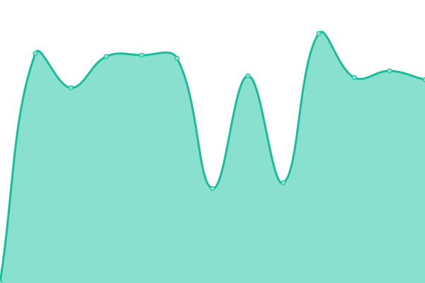
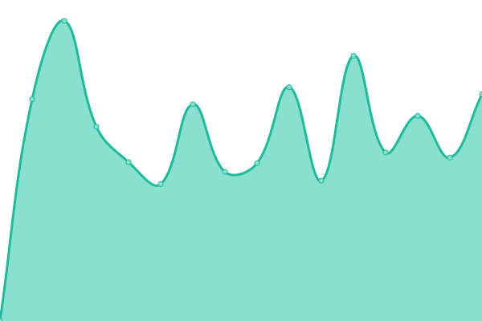

# [📈 Live Status](https://pier4all.github.io/upptime): <!--live status--> **🟩 All systems operational**

This repository contains the open-source uptime monitor and status page for [pier4all AG (Ltd.)](https://pier4all.github.io/upptime), powered by [Upptime](https://github.com/upptime/upptime).

With [Upptime](https://upptime.js.org), you can get your own unlimited and free uptime monitor and status page, powered entirely by a GitHub repository. We use [Issues](https://github.com/pier4all/upptime/issues) as incident reports, [Actions](https://github.com/pier4all/upptime/actions) as uptime monitors, and [Pages](https://pier4all.github.io/upptime) for the status page.

<!--start: status pages-->
<!-- This summary is generated by Upptime (https://github.com/upptime/upptime) -->
<!-- Do not edit this manually, your changes will be overwritten -->
<!-- prettier-ignore -->
| URL | Status | History | Response Time | Uptime |
| --- | ------ | ------- | ------------- | ------ |
|  [enablerr site](https://www.enablerr.ch) | 🟩 Up | [enablerr-site.yml](https://github.com/pier4all/upptime/commits/HEAD/history/enablerr-site.yml) | 

 3743ms
     
 | 

<a href="https://stats.pier4all.ch/history/enablerr-site">100.00%</a>
    

|  [pier4all site](https://www.pier4all.ch) | 🟩 Up | [pier4all-site.yml](https://github.com/pier4all/upptime/commits/HEAD/history/pier4all-site.yml) | 

 2018ms
     
 | 

<a href="https://stats.pier4all.ch/history/pier4all-site">100.00%</a>
    

|  [enablerr online](https://enablerr.online) | 🟩 Up | [enablerr-online.yml](https://github.com/pier4all/upptime/commits/HEAD/history/enablerr-online.yml) | 

 959ms
     
 | 

<a href="https://stats.pier4all.ch/history/enablerr-online">100.00%</a>
    

<!--end: status pages-->

[**Visit our status website →**](https://pier4all.github.io/upptime)

## 📄 License

- Powered by: [Upptime](https://github.com/upptime/upptime)
- Code: [MIT](./LICENSE) © [pier4all AG (Ltd.)](https://pier4all.github.io/upptime)
- Data in the `./history` directory: [Open Database License](https://opendatacommons.org/licenses/odbl/1-0/)
